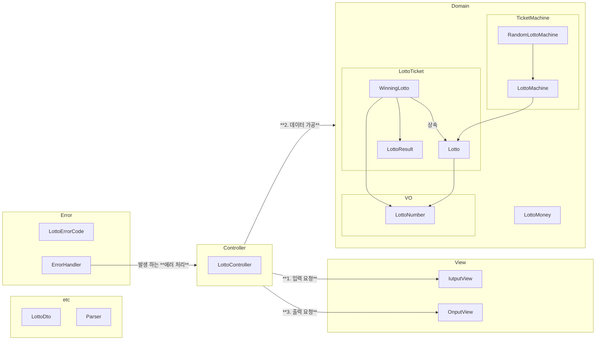

# java-lotto-precourse

# 그래프 다이어그램


# 구현 기능 목록
## 도메인 구성 사항(Model)

### 로또 번호(VO)

- 로또 값의 범위를 관리한다.
    - 로또 번호는 1~45 사이의 숫자이다.   
      `[ERROR] 로또 번호는 1부터 45 사이의 숫자여야 합니다.`
- 정렬을 위한 비교가 가능하다

### 로또

- 로또 번호 구성 관리
    - 로또 번호는 6개의 숫자여야 한다.   
      `[ERROR] 로또 번호는 6개여야 합니다.`
    - 로또 번호는 중복될 수 없다.
      `[ERROR] 로또 번호는 중복될 수 없습니다.`
- 정렬된 숫자를 리턴한다.

### 당첨 번호

- 당첨 로또 번호를 관리한다.
    - 로또 + 보너스 번호로 구성된다.
    - 보너스 번호는 로또번호와 중복 될 수 없다.  
    `[ERROR] 보너스 번호는 로또 번호와 중복될 수 없습니다.`
- 로또의 맞은 개수를 리턴한다.
- 보너스볼 매칭 여부를 리턴한다.

### 당첨 정보

- 당첨 정보를 관리한다.
    - 1등: 6개 일치 / 2,000,000,000원
    - 2등: 5개 일치, 보너스 볼 일치 / 30,000,000원
    - 3등: 5개 일치 / 1,500,000원
    - 4등: 4개 일치 / 50,000원
    - 5등: 3개 일치 / 5,000원
- 맞은 개수와, 보너스볼 매칭 여부로 당첨 등수를 리턴한다.

### 로또 금액

- 금액을 관리한다.
    - 로또 금액은 1000원 단위로 입력해야 한다.  
      `[ERROR] 로또 돈은 1000 단위로 입력해 주세요.`
    - 최소 금액은 1000원이다.  
      `[ERROR] 로또 돈은 1000 단위로 입력해 주세요.`
- 구매 가능한 티켓 개수를 리턴한다.
- 수익률을 반환한다.
    - 사용된 돈이 없다면 예외를 반환한다.   
      `[ERROR] 사용된 돈이 없습니다.`

### 로또 발매기

- 로또를 발매한다.
    - 로또 번호의 범위를 참고한다.
    - 로또 개수를 참고한다.
    - 지정된 개수만큼 발행한다.

### 공통 예외

- 숫자가 아닌 값을 입력했을 때   
  `[ERROR] 숫자를 입력해 주세요`

## 입출력 요구 사항(View)

### 입력

- 로또 구입 금액을 입력 받는다. 구입 금액은 1,000원 단위로 입력 받으며 1,000원으로 나누어 떨어지지 않는 경우 예외 처리한다.
  `14000`
- 당첨 번호를 입력 받는다. 번호는 쉼표(,)를 기준으로 구분한다.
  `1,2,3,4,5,6`
- 보너스 번호를 입력 받는다.
  `7`

### 출력

- 발행한 로또 수량 및 번호를 출력한다. 로또 번호는 오름차순으로 정렬하여 보여준다.

  ```
  8개를 구매했습니다.
  [8, 21, 23, 41, 42, 43]
  [3, 5, 11, 16, 32, 38]
  [7, 11, 16, 35, 36, 44]
  [1, 8, 11, 31, 41, 42]
  [13, 14, 16, 38, 42, 45]
  [7, 11, 30, 40, 42, 43]
  [2, 13, 22, 32, 38, 45]
  [1, 3, 5, 14, 22, 45]
  ```

- 당첨 내역을 출력한다.

  ```
  3개 일치 (5,000원) - 1개
  4개 일치 (50,000원) - 0개
  5개 일치 (1,500,000원) - 0개
  5개 일치, 보너스 볼 일치 (30,000,000원) - 0개
  6개 일치 (2,000,000,000원) - 0개
  ```

- 수익률은 소수점 둘째 자리에서 반올림한다. (ex. 100.0%, 51.5%, 1,000,000.0%)
  `총 수익률은 62.5%입니다.`
- 예외 상황 시 에러 문구를 출력해야 한다. 단, 에러 문구는 "[ERROR]"로 시작해야 한다.
  `[ERROR] 로또 번호는 1부터 45 사이의 숫자여야 합니다.`

### 실행 결과 예시

```
구입금액을 입력해 주세요.
8000

8개를 구매했습니다.
[8, 21, 23, 41, 42, 43]
[3, 5, 11, 16, 32, 38]
[7, 11, 16, 35, 36, 44]
[1, 8, 11, 31, 41, 42]
[13, 14, 16, 38, 42, 45]
[7, 11, 30, 40, 42, 43]
[2, 13, 22, 32, 38, 45]
[1, 3, 5, 14, 22, 45]

당첨 번호를 입력해 주세요.
1,2,3,4,5,6

보너스 번호를 입력해 주세요.
7

당첨 통계
---
3개 일치 (5,000원) - 1개
4개 일치 (50,000원) - 0개
5개 일치 (1,500,000원) - 0개
5개 일치, 보너스 볼 일치 (30,000,000원) - 0개
6개 일치 (2,000,000,000원) - 0개
총 수익률은 62.5%입니다.
```
---
# 구현시 고민한 것
## View의 책임
이전에 저는 `interface InputView` 의 구현체 `ConsoleInputView`를 구현 했습니다.  
DI를 이용해서 객체의 결합도를 낮추었는데요. 이렇게 한 이유는 `View`가 "**어디에, 어떤 형식을**"에 대한 책임이 있다고 생각 했기 때문입니다. 
그래서 이번 구현에서는 **형식을 관리하는 객체** : `Formater`, **어디에 출력할지를 결정하는 객체** `ConsoleInputView`를 구현했습니다.
그리고 실제로 Console.readLine()이 어떻게 동작하는지 찾아보게 되었습니다.  

```java
public class Console {
  private static Scanner scanner;

  private Console() {
  }

  public static String readLine() {
    return getInstance().nextLine();
  }

  public static void close() {
    if (scanner != null) {
      scanner.close();
      scanner = null;
    }

  }

  private static Scanner getInstance() {
    if (scanner == null) {
      scanner = new Scanner(System.in);
    }

    return scanner;
  }
}

---

class Scanner {
  ...
  
  public Scanner(InputStream source) {
    this(new InputStreamReader(source), WHITESPACE_PATTERN);
  }
}

```

`Scanner(System.in)`객체를 생성하는 시점에 `System.in` 이라는 상수 ~~(상수 인데 왜 대문자를 안썼는지 궁금하시다면 찾아보시기 바랍니다!)~~ 에 해당하는 `InputStream` 객체를 복사하여 소유하고 있게 됩니다. 

그래서 `System.setIn()`을 이용하더라도 바꿔치기 할 수 없습니다.  
입력의 경우에는 이렇지만, 출력의 경우에는 `System.setOut()`을 이용하여 출력 스트림을 바꿔치기 할 수 있습니다.  
즉 `OutputView`의 경우에는 객체 자체를 `ConsoleOutputView`,`FileOutputView`,`ByteArrayOutputView`와 같은 객체로 바꿀 이유가 없어졌습니다.

그리고 이번 미션에서는 `Console.readLine()`사용이 강제되기에 `InputView`또한 DI를 이용할 필요가 없어 보였습니다.
그래서 View 는 `형식`을 책임질 필요가 있다고 생각했고, interface를 이용하여 DI를 구현하지 않았습니다.

이 점에 대해서 어떻게 생각 하는지 궁금합니다.

## 함수가 한가지 일만 하도록 하면서 생긴 문제들

### 1. 객체의 노출 (오사용 위험 증가)
아래는 LottoController 의 코드입니다.
```java
class LottoController{
    ...
    public void run() {
        try {
            LottoMoney lottoMoney = new LottoMoney(inputView.readPurchaseCost());
            List<Lotto> lottoTickets = numberGenerator.issueTickets(lottoMoney.purchaseTicket());
            outputView.printTickets(getTicketsDto(lottoTickets));

            WinningLotto winningLotto = new WinningLotto(inputView.readWinningNumbers(), inputView.readBonusNumber());
            List<WinningResult> results = getResults(lottoTickets, winningLotto);
            outputView.printWinningResult(results);

            double revenueRate = lottoMoney.getRevenueRate(getRevenue(lottoTickets, winningLotto));
            outputView.printRevenueRate(revenueRate);
        } finally {
            inputView.close();
        }
    }

    private List<LottoDto> getTicketsDto(List<Lotto> lottoTickets) {
        return lottoTickets.stream()
                .map(Lotto::getSortedNumbers)
                .map(LottoDto::new)
                .toList();
    }

    private List<WinningResult> getResults(List<Lotto> lottoTickets, WinningLotto winningLotto) {
        return lottoTickets.stream()
                .map(winningLotto::matching)
                .toList();
    }

    private Long getRevenue(List<Lotto> lottoTickets, WinningLotto winningLotto) {
        return lottoTickets.stream()
                .map(winningLotto::revenue)
                .reduce(0L, Long::sum);
    }
}
```
함수가 최대한 한가지 일만 하게 되면서 객체간의 협력이 중요해졌고 해당 객체를 이용하여 다른 객체에게 값을 전달해줄 역할이 필요해졌습니다.
하지만 이를 전부 Controller에서 담당하게 되면서 Controller가 많은 역할을 한다고 느껴집니다.

이것을 Service를 이용해서 해결해보고자 했지만, Service는 객체의 상태를 저장하면 안됩니다.
결국 각 함수들의 통신을 위해서는 Controller에서 객체의 상태를 저장해야 하는 문제가 생깁니다.

이점을 어떻게 해결하셨는지 궁금합니다.

### 2. DTO 변환
`View`와 `Model`을 나누게 된 이유는 각 객체의 결합도를 낮추기 위해서 입니다.
결합도를 낮추기 위해서 `DTO`를 사용하게 되었습니다. `DTO`는 `Data Transfer Object` 입니다. 


처음에 저는 `Lotto`에서 `LottoDto`를 반환하도록 설계했습니다.
하지만 객체가 전송객체에 의존하는 방식이 맞지 않다고 생각했습니다.

그리고 자연스럽게 `DTO 변환`은 Controller가 하게 되었습니다.

객체의 결합도를 낮추기 위해서 객체의 참조를 최대한 줄이다 보니 오히려 객체를 이용해서 값을 주입해줘야 하는 책임이 생겼습니다.
객체를 어떻게 설계하면 좋을까요?


## 오류 메시지
저는 이전에 [[예외 팩토리 패턴]](https://youngi2.tistory.com/14) 을 이용하여 사용자가 입력한 값을 오류 메시지에 포함시켰습니다.
하지만 런타임에 가변인자를 넘기기 때문에 컴파일 타임에 오류를 잡을수 없는 문제가 발생했습니다.
또한 가변인자를 처리하는 과정에서 생기는 에러가 너무 많기에 대충 처리하기도 너무 힘들었습니다.

그리고 [[좋은 에러 메시지를 만드는 6가지]](https://toss.tech/article/21021) 를 보게되었습니다.

1. 지금 사용자가 어떤 상황에 처했는지(상황 설명)
2. 그것이 왜 발생했는지(이유)
3. 해결하려면 어떻게 해야하는지(해결책)

이런 메시지를 전달하는데 사용자가 어떤 값을 잘못 입력 했는지 집중하는 것보다, 예외 문구를 어떻게 표현할지에 집중해야 한다고 생각했습니다.
가변인자가 없어도 충분한 정보를 제공한다고 생각 했고, 예외 팩토리 패턴을 사용하지 않고 구현하게 되었습니다.

여러분은 어떻게 생각 하시나요?