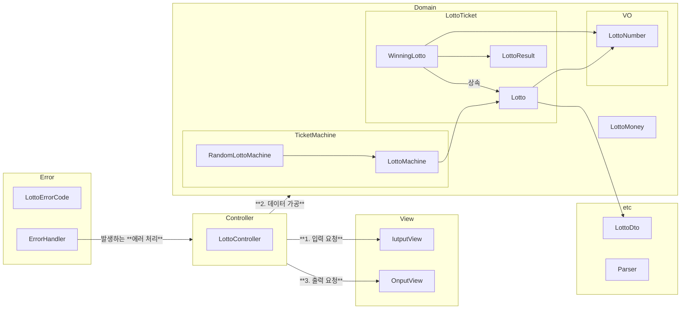

# java-lotto-precourse

# 그래프 다이어그램


# 구현 기능 목록
## 도메인 구성 사항(Model)

### 로또 번호(VO)

- 로또 값의 범위를 관리한다.
    - 로또 번호는 1~45 사이의 숫자이다.   
      `[ERROR] 로또 번호는 1부터 45 사이의 숫자여야 합니다.`
- 정렬을 위한 비교가 가능하다

### 로또

- 로또 번호 구성 관리
    - 로또 번호는 6개의 숫자여야 한다.   
      `[ERROR] 로또 번호는 6개여야 합니다.`
    - 로또 번호는 중복될 수 없다.
      `[ERROR] 로또 번호는 중복될 수 없습니다.`
- 정렬된 숫자를 리턴한다.

### 당첨 번호

- 당첨 로또 번호를 관리한다.
    - 로또 + 보너스 번호로 구성된다.
    - 보너스 번호는 로또번호와 중복 될 수 없다.  
    `[ERROR] 보너스 번호는 로또 번호와 중복될 수 없습니다.`
- 로또의 맞은 개수를 리턴한다.
- 보너스볼 매칭 여부를 리턴한다.

### 당첨 정보

- 당첨 정보를 관리한다.
    - 1등: 6개 일치 / 2,000,000,000원
    - 2등: 5개 일치, 보너스 볼 일치 / 30,000,000원
    - 3등: 5개 일치 / 1,500,000원
    - 4등: 4개 일치 / 50,000원
    - 5등: 3개 일치 / 5,000원
- 맞은 개수와, 보너스볼 매칭 여부로 당첨 등수를 리턴한다.

### 로또 금액

- 금액을 관리한다.
    - 로또 금액은 1000원 단위로 입력해야 한다.  
      `[ERROR] 로또 돈은 1000 단위로 입력해 주세요.`
    - 최소 금액은 1000원이다.  
      `[ERROR] 로또 돈은 1000 단위로 입력해 주세요.`
- 구매 가능한 티켓 개수를 리턴한다.
- 수익률을 반환한다.
    - 사용된 돈이 없다면 예외를 반환한다.   
      `[ERROR] 사용된 돈이 없습니다.`

### 로또 발매기

- 로또를 발매한다.
    - 로또 번호의 범위를 참고한다.
    - 로또 개수를 참고한다.
    - 지정된 개수만큼 발행한다.

### 공통 예외

- 숫자가 아닌 값을 입력했을 때   
  `[ERROR] 숫자를 입력해 주세요`

## 입출력 요구 사항(View)

### 입력

- 로또 구입 금액을 입력 받는다. 구입 금액은 1,000원 단위로 입력 받으며 1,000원으로 나누어 떨어지지 않는 경우 예외 처리한다.
  `14000`
- 당첨 번호를 입력 받는다. 번호는 쉼표(,)를 기준으로 구분한다.
  `1,2,3,4,5,6`
- 보너스 번호를 입력 받는다.
  `7`

### 출력

- 발행한 로또 수량 및 번호를 출력한다. 로또 번호는 오름차순으로 정렬하여 보여준다.

  ```
  8개를 구매했습니다.
  [8, 21, 23, 41, 42, 43]
  [3, 5, 11, 16, 32, 38]
  [7, 11, 16, 35, 36, 44]
  [1, 8, 11, 31, 41, 42]
  [13, 14, 16, 38, 42, 45]
  [7, 11, 30, 40, 42, 43]
  [2, 13, 22, 32, 38, 45]
  [1, 3, 5, 14, 22, 45]
  ```

- 당첨 내역을 출력한다.

  ```
  3개 일치 (5,000원) - 1개
  4개 일치 (50,000원) - 0개
  5개 일치 (1,500,000원) - 0개
  5개 일치, 보너스 볼 일치 (30,000,000원) - 0개
  6개 일치 (2,000,000,000원) - 0개
  ```

- 수익률은 소수점 둘째 자리에서 반올림한다. (ex. 100.0%, 51.5%, 1,000,000.0%)
  `총 수익률은 62.5%입니다.`
- 예외 상황 시 에러 문구를 출력해야 한다. 단, 에러 문구는 "[ERROR]"로 시작해야 한다.
  `[ERROR] 로또 번호는 1부터 45 사이의 숫자여야 합니다.`

### 실행 결과 예시

```
구입금액을 입력해 주세요.
8000

8개를 구매했습니다.
[8, 21, 23, 41, 42, 43]
[3, 5, 11, 16, 32, 38]
[7, 11, 16, 35, 36, 44]
[1, 8, 11, 31, 41, 42]
[13, 14, 16, 38, 42, 45]
[7, 11, 30, 40, 42, 43]
[2, 13, 22, 32, 38, 45]
[1, 3, 5, 14, 22, 45]

당첨 번호를 입력해 주세요.
1,2,3,4,5,6

보너스 번호를 입력해 주세요.
7

당첨 통계
---
3개 일치 (5,000원) - 1개
4개 일치 (50,000원) - 0개
5개 일치 (1,500,000원) - 0개
5개 일치, 보너스 볼 일치 (30,000,000원) - 0개
6개 일치 (2,000,000,000원) - 0개
총 수익률은 62.5%입니다.
```

# 구현시 고민한 것
